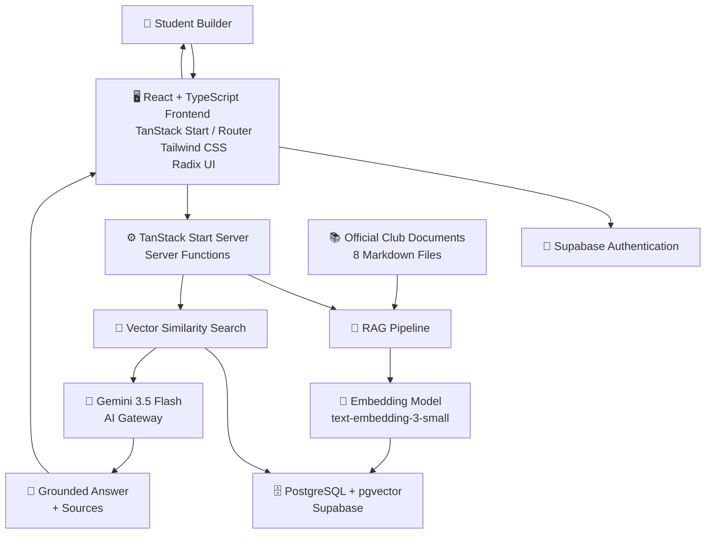
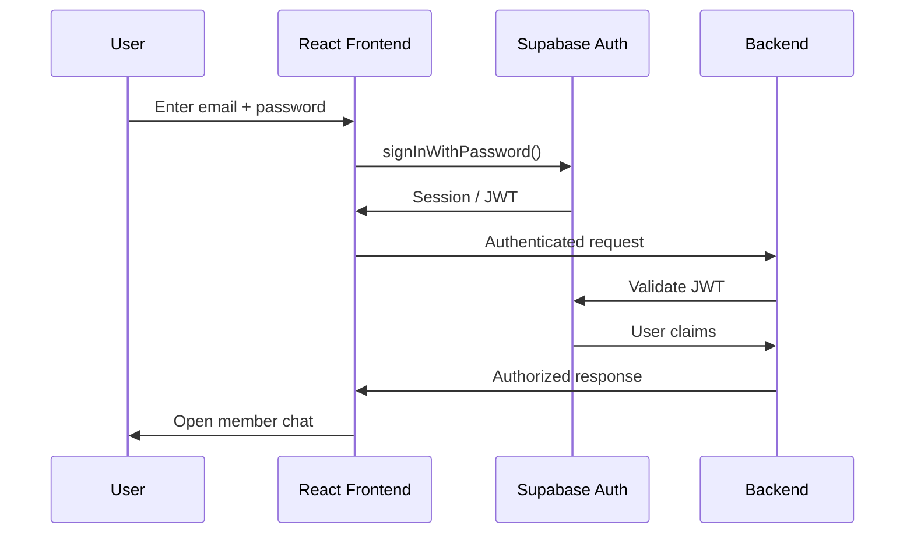
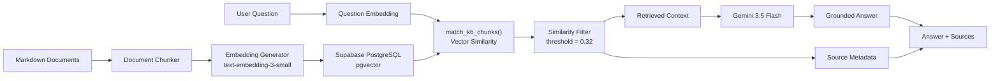

# 🚀 Club Member Portal — AWS Student Builder AI Copilot

<p align="center">
  
  
  
  
  
</p>

<p align="center">
  <b>An AI-powered member portal and knowledge-base copilot for the AWS Student Builder Group at RGUKT-ONGOLE.</b>
</p>

---

## 📌 Project Overview

**Club Member Portal** is an AI-powered web application designed for members of the AWS Student Builder Group at RGUKT-ONGOLE.

The platform combines:

* 🔐 Secure member authentication
* 💬 Members-only AI chatbot
* 📚 Document-based knowledge base
* 🔎 Semantic/vector search
* 🧠 Retrieval-Augmented Generation (RAG)
* 📖 Source-aware answers
* 💾 Per-user chat history
* 👍/👎 Answer feedback
* 🔄 Password reset functionality
* 🎨 Modern responsive UI
* ☁️ AWS-oriented cloud deployment architecture

The core objective is to allow a new Student Builder to log in and ask questions such as:

> "When is the next workshop?"

> "How do I publish on Builder Center?"

> "How do I get started with Amazon Bedrock?"

Instead of relying on general internet knowledge, the AI retrieves information from the official club documents and generates an answer grounded in that retrieved context.

The original 70% challenge explicitly required members to sign up, log in, access a members-only chat, load the eight starter documents, provide source citations, and provide a safe fallback when information is not available.

---

# 🎯 Problem Statement

Student communities often distribute important information through multiple documents, messages, workshops, and announcements.

This creates several problems:

* Members have difficulty finding the correct information.
* New members may not know where to start.
* Important AWS learning information can be buried inside documents.
* Manually searching through multiple Markdown files is inefficient.
* A normal chatbot may hallucinate information that is not part of the official club material.
* Members need a way to verify where an AI answer came from.

The **Club Member Portal** addresses these problems by providing a centralized authenticated portal with an AI copilot that retrieves information from the official club knowledge base before generating answers.

---

# 💡 Solution

The system follows a **Retrieval-Augmented Generation (RAG)** architecture.

Instead of directly asking an LLM:

```text
User Question
     ↓
     LLM
     ↓
Generated Answer
```

our system follows:

```text
User Question
     ↓
Generate Query Embedding
     ↓
Vector Similarity Search
     ↓
Retrieve Relevant Club Documents
     ↓
Provide Retrieved Context to LLM
     ↓
Generate Grounded Answer
     ↓
Display Answer + Sources
```

This reduces hallucination and keeps responses grounded in the official knowledge base.

---

# ✨ Key Features

## 🔐 1. Member Authentication

Members can:

* Create an account
* Log in using email and password
* Verify their email
* Reset forgotten passwords
* Access protected chat functionality

Authentication is implemented using **Supabase Auth**.

Only authenticated users can access the chatbot.

---

## 💬 2. Members-Only AI Chat

The chatbot is available only to authenticated members.

Users can ask questions related to:

* AWS Student Builder Groups
* AWS account setup
* Builder Center
* Amazon Bedrock
* AWS Lambda
* Workshops
* Hackathon rules
* Club community information

---

## 📚 3. Official Knowledge Base

The application includes the eight starter club documents required by the hackathon:

```text
01-onboarding-faq.md
02-aws-account-setup.md
03-builder-center-publish.md
04-bedrock-starter.md
05-hackathon-rules.md
06-workshop-index.md
07-lambda-patterns.md
08-sbg-community.md
```

These documents contain the information used by the RAG system.

The hackathon specification requires the AI to answer only from club documents and show sources with each answer.

---

# 🧠 4. Retrieval-Augmented Generation (RAG)

The most important technical component of the project is the RAG pipeline.

### Step 1 — Document Loading

The application loads Markdown documents from:

```text
/docs/*.md
```

The documents are imported by the server at startup/runtime.

### Step 2 — Document Chunking

Documents are divided into smaller chunks based on Markdown headings.

Each chunk contains:

```text
Document Name
Heading
Content
```

Example:

```text
03-builder-center-publish.md
        ↓
Publishing on AWS Builder Center
        ↓
Chunk content
```

### Step 3 — Embedding Generation

Each chunk is converted into a numerical vector using:

```text
OpenAI text-embedding-3-small
```

through the AI Gateway used by the application.

### Step 4 — Vector Storage

The generated embeddings are stored inside PostgreSQL using:

```text
pgvector
```

The database contains a vector column with:

```text
vector(1536)
```

### Step 5 — Semantic Search

When the user asks a question:

```text
"What is Builder Center?"
```

the question is converted into an embedding.

The system then performs vector similarity search against the stored document chunks.

### Step 6 — Relevance Filtering

Retrieved chunks are filtered using a similarity threshold.

The current implementation uses:

```text
MIN_SIMILARITY = 0.32
```

### Step 7 — LLM Generation

The relevant document context is passed to the chat model.

The current project uses:

```text
google/gemini-3.5-flash
```

through the AI Gateway.

### Step 8 — Grounded Response

The generated response is shown to the user together with the relevant source document and section.

---

# 🛡️ 5. Hallucination Prevention

The system uses a strict system prompt instructing the AI to:

* Answer only from retrieved context
* Avoid guessing
* Avoid inventing AWS pricing
* Avoid inventing AWS service limits
* Avoid inventing policies
* Stay focused on club/AWS learning topics

If relevant information cannot be retrieved, the system marks the response as unverified instead of presenting unsupported information as fact.

This follows the hackathon's requirement that the chatbot should not guess when information is unavailable.

---

# 📖 6. Source Citations

Each generated answer can contain source information such as:

```text
Source:
03-builder-center-publish.md
Section:
How do I publish on Builder Center?
```

The backend stores the source document and heading along with the assistant message.

This allows members to verify the information against the original club document.

---

# 💾 7. Chat History

The application stores chat messages per authenticated user.

Each message contains:

```text
id
user_id
role
content
sources
feedback
created_at
```

Users can retrieve their previous conversations.

Users can also clear their chat history.

---

# 👍 8. Answer Feedback

Users can provide feedback on AI responses:

```text
👍 Helpful
👎 Not Helpful
```

The feedback value is stored with the corresponding message.

This creates a foundation for future chatbot quality analysis.

---

# 🔑 9. Password Reset

Members who forget their password can request a password reset through their registered email.

The authentication flow is handled through Supabase Auth.

---

# 🎨 10. Modern User Interface

The frontend provides:

* Responsive layout
* Dark/light theme support
* Animated visual elements
* AWS Student Builder branding
* Chat interface
* Authentication screens
* Password visibility toggle
* Source cards
* Loading states
* Error handling
* Empty states

---

# 🏗️ System Architecture

## 🔷 High-Level Architecture

The overall architecture can be represented as:



---

# 🏢 High-Level System Design

At the highest level, the system contains five major layers:

```text
┌───────────────────────────────────────┐
│             USER LAYER                │
│       Student Builder / Member        │
└──────────────────┬────────────────────┘
                   │
                   ▼
┌───────────────────────────────────────┐
│          PRESENTATION LAYER            │
│ React + TypeScript + TanStack Router   │
│ Tailwind CSS + Radix UI + Three.js     │
└──────────────────┬────────────────────┘
                   │
                   ▼
┌───────────────────────────────────────┐
│           APPLICATION LAYER            │
│       TanStack Start Server            │
│       Server Functions + Auth          │
└──────────────────┬────────────────────┘
                   │
                   ▼
┌───────────────────────────────────────┐
│              AI / RAG LAYER            │
│ Chunking → Embeddings → Retrieval      │
│ → Context → Gemini → Grounded Answer   │
└──────────────────┬────────────────────┘
                   │
                   ▼
┌───────────────────────────────────────┐
│             DATA LAYER                 │
│ Supabase PostgreSQL + pgvector         │
│ Messages + Knowledge Base              │
└───────────────────────────────────────┘
```

---

# 🔬 Low-Level System Architecture

## Authentication Flow



---

# 🧠 Low-Level RAG Architecture



---

# 🔄 Detailed RAG Request Flow

When a member asks a question:

```text
1. User submits question
          ↓
2. Authentication middleware verifies user
          ↓
3. User question is stored in messages table
          ↓
4. Knowledge base is checked
          ↓
5. Documents are chunked if required
          ↓
6. Document embeddings are generated
          ↓
7. Embeddings are stored in pgvector
          ↓
8. User question is converted to an embedding
          ↓
9. match_kb_chunks() performs vector search
          ↓
10. Top relevant chunks are retrieved
          ↓
11. Similarity threshold removes weak matches
          ↓
12. Retrieved context is passed to Gemini
          ↓
13. Gemini generates a grounded answer
          ↓
14. Relevant source documents are attached
          ↓
15. Assistant response is stored
          ↓
16. Answer + sources are displayed to member
```

---

# 🛠️ Tech Stack

## Frontend

| Technology        | Purpose                        |
| ----------------- | ------------------------------ |
| React 19          | UI development                 |
| TypeScript        | Type-safe development          |
| TanStack Router   | Routing                        |
| TanStack Start    | Full-stack React framework     |
| Tailwind CSS      | Styling                        |
| Radix UI          | Accessible UI components       |
| Lucide React      | Icons                          |
| React Markdown    | Markdown rendering             |
| Three.js          | 3D visual elements             |
| React Three Fiber | React integration for Three.js |
| React Three Drei  | Three.js helper components     |

---

## Backend

| Technology            | Purpose                            |
| --------------------- | ---------------------------------- |
| TanStack Start Server | Server-side application            |
| TypeScript            | Backend development                |
| Server Functions      | Secure client-server communication |
| Zod                   | Request validation                 |
| Supabase              | Backend platform                   |
| PostgreSQL            | Persistent database                |

---

## Authentication

```text
Supabase Auth
```

Used for:

* Sign up
* Login
* Email verification
* Password reset
* Session management
* JWT-based authentication

---

## AI / Generative AI

### Embeddings

```text
OpenAI text-embedding-3-small
```

Used to convert document chunks and user questions into vectors.

### Chat Model

```text
Google Gemini 3.5 Flash
```

Used to generate grounded answers from retrieved context.

### AI Gateway

```text
https://ai.gateway.lovable.dev/v1
```

The current implementation accesses the embedding and chat models through the AI Gateway.

---

## Vector Database

```text
PostgreSQL
+
pgvector
```

Used for semantic similarity search.

---

## Development Tools

```text
Bun
Vite
ESLint
Prettier
Git
GitHub
Lovable
```

The repository includes a `bun.lock` file and project scripts for development, building, previewing, linting, and formatting.

---

### AWS Service Mapping

| Application Component | AWS Service          |
| --------------------- | -------------------- |
| Authentication        | Amazon Cognito       |
| Password reset email  | Amazon SES           |
| Document storage      | Amazon S3            |
| Serverless backend    | AWS Lambda           |
| API                   | API Gateway / Lambda |
| Vector search         | Amazon OpenSearch    |
| Generative AI         | Amazon Bedrock       |
| Static web hosting    | S3 + CloudFront      |
| Monitoring            | Amazon CloudWatch    |

# 📂 Project Structure

```text
club_member_portal/
│
├── docs/
│   ├── 01-onboarding-faq.md
│   ├── 02-aws-account-setup.md
│   ├── 03-builder-center-publish.md
│   ├── 04-bedrock-starter.md
│   ├── 05-hackathon-rules.md
│   ├── 06-workshop-index.md
│   ├── 07-lambda-patterns.md
│   └── 08-sbg-community.md
│
├── public/
│   ├── favicon.ico
│   └── robots.txt
│
├── src/
│   │
│   ├── assets/
│   │
│   ├── components/
│   │   ├── chat/
│   │   │   ├── EmptyState.tsx
│   │   │   ├── MessageBubble.tsx
│   │   │   └── UnverifiedCard.tsx
│   │   │
│   │   ├── ui/
│   │   ├── AppHeader.tsx
│   │   ├── ClubBadge.tsx
│   │   ├── PasswordInput.tsx
│   │   ├── SceneBackground.tsx
│   │   └── ThemeToggle.tsx
│   │
│   ├── hooks/
│   │   ├── useAuth.tsx
│   │   └── use-mobile.tsx
│   │
│   ├── integrations/
│   │   └── supabase/
│   │       ├── auth-attacher.ts
│   │       ├── auth-middleware.ts
│   │       ├── client.ts
│   │       ├── client.server.ts
│   │       └── types.ts
│   │
│   ├── lib/
│   │   ├── chat.functions.ts
│   │   ├── error-capture.ts
│   │   ├── error-page.ts
│   │   ├── kb.server.ts
│   │   ├── lovable-error-reporting.ts
│   │   └── utils.ts
│   │
│   ├── routes/
│   │   ├── __root.tsx
│   │   ├── chat.tsx
│   │   ├── index.tsx
│   │   ├── login.tsx
│   │   ├── reset-password.tsx
│   │   └── signup.tsx
│   │
│   ├── router.tsx
│   ├── routeTree.gen.ts
│   ├── server.ts
│   ├── start.ts
│   └── styles.css
│
├── supabase/
│   ├── migrations/
│   │   ├── messages table
│   │   └── knowledge base + vector search
│   └── config.toml
│
├── .env
├── package.json
├── bun.lock
├── tsconfig.json
├── vite.config.ts
├── eslint.config.js
├── components.json
└── README.md
```

---

# 🚀 Getting Started

## 1. Clone the repository

```bash
git clone https://github.com/SHAIKMUZKEER/club_member_portal.git
cd club_member_portal
```

## 2. Install dependencies

Using Bun:

```bash
bun install
```

Or using npm:

```bash
npm install
```

## 3. Configure environment variables

Create a `.env` file:

```env
SUPABASE_PROJECT_ID=your_project_id
SUPABASE_PUBLISHABLE_KEY=your_publishable_key
SUPABASE_URL=your_supabase_url

VITE_SUPABASE_PROJECT_ID=your_project_id
VITE_SUPABASE_PUBLISHABLE_KEY=your_publishable_key
VITE_SUPABASE_URL=your_supabase_url

LOVABLE_API_KEY=your_lovable_api_key
```

> Never commit real API keys, passwords, Supabase secrets, or private credentials to GitHub.

## 4. Run the development server

```bash
bun run dev
```

Or:

```bash
npm run dev
```

## 5. Open the application

The development server will provide a local URL such as:

```text
http://localhost:3000
```

---


# 🌟 Why This Project Is Different

Traditional student portals generally provide static information.

This project introduces an **AI knowledge interface** on top of the club's official documentation.

Instead of:

```text
Search document
      ↓
Read multiple sections
      ↓
Find answer
```

the member can:

```text
Ask Question
      ↓
AI retrieves relevant information
      ↓
AI generates grounded response
      ↓
Source is shown
```

The system therefore combines:

```text
Authentication
      +
Knowledge Base
      +
Vector Search
      +
Generative AI
      +
Source Attribution
      +
User History
```

---

# 📈 Future Improvements

Potential future enhancements include:

* ☁️ Full AWS deployment
* 🔐 Amazon Cognito integration
* 📧 Amazon SES integration
* 📦 Amazon S3 document storage
* ⚡ AWS Lambda backend
* 🔎 Amazon OpenSearch vector search
* 🤖 Amazon Bedrock integration
---
# 👥 Team

### Team Members

| Name              | Role                        | LinkedIn                                       |
| ----------------- | --------------------------- | ---------------------------------------------- |
| **SHAIK MUZKEER** | Developer / AI & Full-Stack | [LinkedIn Profile](https://www.linkedin.com/in/shaik-muzkeer-292141340/)          |
| **K AHAMED** | Developer                   | [LinkedIn Profile](https://www.linkedin.com/in/ahamed-konduru-192732376/) |
| **VARSHINI** | Developer                   | [LinkedIn Profile](https://www.linkedin.com/in/varshini-arudra-0a4815375?utm_source=share_via&utm_content=profile&utm_medium=member_android) |

---

# 🔗 Project Links

### 💻 GitHub Repository

👉 [View Source Code](https://github.com/SHAIKMUZKEER/club_member_portal)

### 🌐 Live Application

👉 **[Open Live App](YOUR_LIVE_APP_URL)**

### 👤 LinkedIn — Your Profile

👉 **[Connect with me on LinkedIn](https://www.linkedin.com/in/shaik-muzkeer-292141340/)**
---

# 📄 License

This project was created as an original hackathon project.

Open-source libraries and frameworks used by the project remain subject to their respective licenses.

---
# ⭐ Support

If you find this project interesting, consider:

⭐ Starring the repository

🍴 Forking the project

💬 Sharing feedback

🔗 Connecting with the team on LinkedIn

---

<p align="center">
  <b>Built with ❤️, ☁️ AWS, 🤖 AI, and a lot of debugging.</b>
</p>

<p align="center">
  <b>Club Member Portal — AWS Student Builder Group · RGUKT-ONGOLE</b>
</p>
